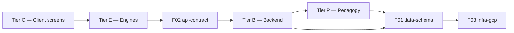
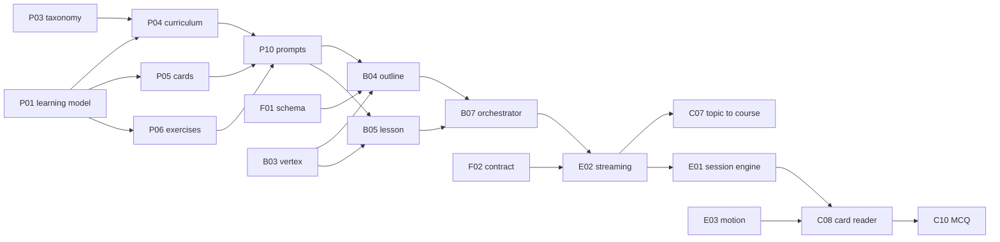

# Module index

The project decomposed into **69 modules**, each a unit of work one session can
own end to end. Every module has a spec in this directory and (except `E06`) a
folder in the repo containing a README stub that links back to it.

---

## How these documents relate to the originals

> `FEATURE_PLAN.md` and `ARCHITECTURE.md` are the **frozen v1 vision and the
> locked decision record**. They are not updated as work proceeds.
> **Module specs are the living working documents.** Where they disagree, the
> module spec wins.

Nothing was removed from the originals during this split — every section of both
is cited by at least one spec, and the [coverage map](#coverage-map) records
where. Specs were extracted, not invented; the only new material is each module's
interface, feel spec, and acceptance criteria, which the originals do not cover.

---

## Tiers

| Tier | What it is | Count |
|------|-----------|-------|
| **F** — Foundation | Schema, contract, infrastructure, CI, cross-cutting concerns | 8 |
| **P** — Pedagogy & content intelligence | What the AI teaches, how it grounds it, and what gates it | 17 |
| **E** — Engines & experience | The runtime that makes the app *feel* like the product | 6 |
| **B** — Backend | Python / FastAPI services on Cloud Run | 19 |
| **C** — Client | Flutter screens and features | 19 |

Dependency direction is one-way:



No backend module may depend on a client or engine module. No engine module may
depend on a Tier C screen. **No pedagogy module may depend on B, C, or E at
runtime** — `P17` is the documented exception, because an offline eval harness
necessarily drives the pipeline it evaluates.

---

## Tier F — Foundation & cross-cutting

| ID | Module | Code location | Milestone |
|----|--------|---------------|-----------|
| [F01](F01-data-schema.md) | data-schema | `packages/schema/` | 1 |
| [F02](F02-api-contract.md) | api-contract | `packages/contracts/` | 1 |
| [F03](F03-infra-gcp.md) | infra-gcp | `infra/gcp/` | 1 |
| [F04](F04-ci-backend.md) | ci-backend | `infra/ci/backend/` | 1 |
| [F05](F05-ci-mobile.md) | ci-mobile | `infra/ci/mobile/` | 1 |
| [F06](F06-analytics.md) | analytics | `packages/analytics/` | 10 |
| [F07](F07-llm-cost-observability.md) | llm-cost-observability | `services/api/app/shared/cost/` | 9 |
| [F08](F08-content-moderation.md) | content-moderation | `services/api/app/shared/moderation/` | 8 |

## Tier P — Pedagogy & content intelligence

What the AI actually teaches. Tiers B and C move a course around; this tier
decides whether it is worth learning from. Each authoring module owns both a
human-readable rule **and** the prompt fragment expressing it, so changing how the
AI teaches has exactly one file.

```
P05 card rules ──▶ prompt fragment ──▶ P10 composes ──▶ B05 executes
                                                            │
                              P17 scores against P16 rubric ◀┘
                                        │
                                   gate: ship or regenerate
```

**Instructional design**

| ID | Module | Code location | Milestone |
|----|--------|---------------|-----------|
| [P01](P01-learning-model.md) | learning-model | `packages/pedagogy/` | 2 |
| [P02](P02-vertical-packs.md) | vertical-packs | `packages/pedagogy/verticals/` | 2 |
| [P03](P03-topic-taxonomy-scoping.md) | topic-taxonomy-scoping | `packages/pedagogy/taxonomy/` | 2 |
| [P04](P04-curriculum-architecture.md) | curriculum-architecture | `packages/pedagogy/curriculum/` | 2 |
| [P05](P05-card-authoring-rules.md) | card-authoring-rules | `packages/pedagogy/cards/` | 2 |
| [P06](P06-exercise-design.md) | exercise-design | `packages/pedagogy/exercises/` | 2 |
| [P07](P07-distractor-design.md) | distractor-design | `packages/pedagogy/distractors/` | 3 |
| [P08](P08-explanation-authoring.md) | explanation-authoring | `packages/pedagogy/explanations/` | 3 |
| [P09](P09-difficulty-semantics.md) | difficulty-semantics | `packages/pedagogy/difficulty/` | 3 |

**Prompt engineering**

| ID | Module | Code location | Milestone |
|----|--------|---------------|-----------|
| [P10](P10-prompt-architecture.md) | prompt-architecture | `services/api/app/generation/prompts/` | 2 |

**Retrieval & grounding**

| ID | Module | Code location | Milestone |
|----|--------|---------------|-----------|
| [P11](P11-source-curation.md) | source-curation | `services/api/app/knowledge/sources/` | 4 |
| [P12](P12-knowledge-ingestion.md) | knowledge-ingestion | `services/api/app/knowledge/ingestion/` | 4 |
| [P13](P13-retrieval-at-generation.md) | retrieval-at-generation | `services/api/app/knowledge/retrieval/` | 4 |
| [P14](P14-grounding-attribution.md) | grounding-attribution | `services/api/app/generation/grounding/` | 4 |

**Quality assurance**

| ID | Module | Code location | Milestone |
|----|--------|---------------|-----------|
| [P15](P15-coherence-checks.md) | coherence-checks | `services/api/app/generation/coherence/` | 4 |
| [P16](P16-quality-rubric.md) | quality-rubric | `packages/pedagogy/rubric/` | 2 draft, 4 enforced |
| [P17](P17-content-eval-harness.md) | content-eval-harness | `tools/content_eval/` | 4 |

### Two decisions that shape this tier

**No human review gate in v1.** Generated content reaches learners unreviewed, so
`P17` is a *blocking* gate rather than a report, and `P16`'s accuracy dimension is
non-tradeable. The `B10` shared cache is what makes gating every lesson
affordable — a cached course is judged once and served to many.

**Retrieval grounding, and its architecture divergence.**
`ARCHITECTURE.md:55-56` treats vector search as "a bonus for later (semantic
review, RAG over course content) without adding another datastore". Grounding
content by retrieval promotes that to v1. It is **not** an architecture violation
— Data Connect already provides the vector store, so the no-second-datastore
commitment holds — but it adds `P11`–`P14`, corpus tables in `F01`, and a
retrieval hop in front of generation that `E06` now budgets for. Per the drift
convention above, `ARCHITECTURE.md` stays frozen and `P12`/`P13` carry the change.

## Tier E — Engines & experience runtime

The layer that makes the app *feel* like the product described rather than merely
do what it describes. Everything in Tier C composes these; nothing here renders a
screen of its own.

| ID | Module | Code location | Milestone |
|----|--------|---------------|-----------|
| [E01](E01-session-engine.md) | session-engine | `apps/mobile/lib/engine/session/` | 2 |
| [E02](E02-streaming-engine.md) | streaming-engine | `apps/mobile/lib/engine/streaming/` | 2 |
| [E03](E03-motion-system.md) | motion-system | `apps/mobile/lib/engine/motion/` | 1 |
| [E04](E04-juice-layer.md) | juice-layer | `apps/mobile/lib/engine/juice/` | 3 |
| [E05](E05-xp-scoring-engine.md) | xp-scoring-engine | `apps/mobile/lib/engine/scoring/` | 5 |
| [E06](E06-experience-spec.md) | experience-spec | *(spec only)* | 1 |

## Tier B — Backend

| ID | Module | Code location | Milestone |
|----|--------|---------------|-----------|
| [B01](B01-auth-identity.md) | auth-identity | `services/api/app/identity/` | 1 |
| [B02](B02-account-lifecycle.md) | account-lifecycle | `services/api/app/accounts/` | 1, 6 |
| [B03](B03-vertex-client.md) | vertex-client | `services/api/app/llm/` | 2 |
| [B04](B04-outline-generator.md) | outline-generator | `services/api/app/generation/outline/` | 2 |
| [B05](B05-lesson-generator.md) | lesson-generator | `services/api/app/generation/lesson/` | 2 |
| [B06](B06-content-validation.md) | content-validation | `services/api/app/generation/validation/` | 4 |
| [B07](B07-generation-orchestrator.md) | generation-orchestrator | `services/api/app/generation/orchestrator/` | 2 |
| [B08](B08-sandbox-runtime.md) | sandbox-runtime | `services/api/app/sandbox/` | 4 |
| [B09](B09-answer-key-verification.md) | answer-key-verification | `services/api/app/verification/` | 4 |
| [B10](B10-course-cache.md) | course-cache | `services/api/app/generation/cache/` | 9 |
| [B11](B11-enrollment-service.md) | enrollment-service | `services/api/app/enrollment/` | 1 |
| [B12](B12-progress-service.md) | progress-service | `services/api/app/progress/` | 5 |
| [B13](B13-difficulty-adaptation.md) | difficulty-adaptation | `services/api/app/difficulty/` | 3 |
| [B14](B14-habit-engine.md) | habit-engine | `services/api/app/habit/` | 6 |
| [B15](B15-review-scheduler.md) | review-scheduler | `services/api/app/review/` | 7 |
| [B16](B16-tutor-service.md) | tutor-service | `services/api/app/tutor/service/` | 8 |
| [B17](B17-tutor-guardrails.md) | tutor-guardrails | `services/api/app/tutor/guardrails/` | 8 |
| [B18](B18-notification-scheduler.md) | notification-scheduler | `services/api/app/notifications/scheduler/` | 6 |
| [B19](B19-fcm-delivery.md) | fcm-delivery | `services/api/app/notifications/fcm/` | 6 |

`B07`, `B08`, `B13`, `B14`, `B15` are **backend engines** — their specs carry
state machine, invariant, and failure-mode sections.

## Tier C — Client

| ID | Module | Code location | Milestone |
|----|--------|---------------|-----------|
| [C01](C01-app-shell.md) | app-shell | `apps/mobile/lib/core/shell/` | 1 |
| [C02](C02-design-system.md) | design-system | `apps/mobile/lib/core/design_system/` | 1 |
| [C03](C03-api-client.md) | api-client | `apps/mobile/lib/core/api_client/` | 1 |
| [C04](C04-local-persistence.md) | local-persistence | `apps/mobile/lib/core/storage/` | 1 |
| [C05](C05-auth-ui.md) | auth-ui | `apps/mobile/lib/features/auth/` | 1 |
| [C06](C06-onboarding-flow.md) | onboarding-flow | `apps/mobile/lib/features/onboarding/` | 1, 10 |
| [C07](C07-topic-to-course-flow.md) | topic-to-course-flow | `apps/mobile/lib/features/topic_to_course/` | 2 |
| [C08](C08-card-reader.md) | card-reader | `apps/mobile/lib/features/learn/card_reader/` | 2 |
| [C09](C09-card-renderers.md) | card-renderers | `apps/mobile/lib/features/learn/card_renderers/` | 3 |
| [C10](C10-exercise-mcq.md) | exercise-mcq | `apps/mobile/lib/features/learn/exercises/mcq/` | 2 |
| [C11](C11-exercise-predict-output.md) | exercise-predict-output | `.../exercises/predict_output/` | 3 |
| [C12](C12-exercise-fill-blank.md) | exercise-fill-blank | `.../exercises/fill_blank/` | 3 |
| [C13](C13-exercise-order-steps.md) | exercise-order-steps | `.../exercises/order_steps/` | 3 |
| [C14](C14-exercise-feedback.md) | exercise-feedback | `apps/mobile/lib/features/learn/feedback/` | 3 |
| [C15](C15-win-screen.md) | win-screen | `apps/mobile/lib/features/learn/win_screen/` | 5 |
| [C16](C16-home-screen.md) | home-screen | `apps/mobile/lib/features/home/` | 6 |
| [C17](C17-review-session-ui.md) | review-session-ui | `apps/mobile/lib/features/review/` | 7 |
| [C18](C18-tutor-chat-ui.md) | tutor-chat-ui | `apps/mobile/lib/features/tutor/` | 8 |
| [C19](C19-profile-settings.md) | profile-settings | `apps/mobile/lib/features/profile_settings/` | 6 |

---

## Build order

Following the ten milestones in `FEATURE_PLAN.md:186-201`. Milestones 1–6 are the
**launch-blocking minimum**; 7 and 8 are high-value fast-follows if timelines slip
(`FEATURE_PLAN.md:201`).

| # | Milestone | Modules |
|---|-----------|---------|
| 1 | Skeleton + auth | `F01` `F02` `F03` `F04` `F05` `E03` `E06` `B01` `B02` `B11` `C01` `C02` `C03` `C04` `C05` `C06` |
| 2 | Generation vertical slice | `P01` `P02` `P03` `P04` `P05` `P06` `P10` `P16`(draft) `B03` `B04` `B05` `B07` `E01` `E02` `C07` `C08` `C10` |
| 3 | All card & exercise types | `P07` `P08` `P09` `B13` `E04` `C09` `C11` `C12` `C13` `C14` |
| 4 | **Trustworthy content** | `B06` `B08` `B09` `P11` `P12` `P13` `P14` `P15` `P16` `P17` |
| 5 | Progress + win screen | `B12` `E05` `C15` |
| 6 | Habit loop | `B14` `B18` `B19` `C16` `C19` |
| 7 | Review mode | `B15` `C17` |
| 8 | Tutor chat | `F08` `B16` `B17` `C18` |
| 9 | Shared-course cache + cost controls | `B10` `F07` |
| 10 | Polish + onboarding tuning + analytics | `F06`, revisit `C06` |

**Milestone 4 grew substantially.** It was "answer-key sandbox + schema
validation"; it is now the whole trust story — executable verification, retrieval
grounding, coherence, and the quality gate. That is the honest consequence of
shipping AI content with no human reviewer: everything that stands between a bad
course and a learner lands here, and none of it can be deferred past the point
where real users arrive.

Milestones 1–3 can run with prompt-constraint grounding only (`P14`'s ungrounded
path), which is a legitimate internal-testing configuration. It is not a
public-exposure configuration.

### Milestone 2 critical path

The vertical slice that proves the product. Everything else is breadth on top of
this spine:



---

## Coverage map

Every section of both source documents maps to at least one module. This is the
check that the split was lossless.

### `FEATURE_PLAN.md`

| Section | Lines | Modules |
|---------|-------|---------|
| Context, decisions | 3–11 | `P02` (vertical choice, line 8) — otherwise framing carried in inherited decisions |
| The Core Loop | 15–22 | `E01` `E06` `B04` `B05` `P01` `P09` (line 22) |
| § 1 Onboarding & First Run | 28–43 | `C06` `C07` `C05` `B02` `E02` `E06` `P09` (line 35) |
| § 2 AI Course Generation | 45–85 | `P01`–`P14` `B03` `B04` `B05` `B06` `B07` `B08` `B09` `B10` `B13` `B16` `B17` `F07` `F08` `C07` `C12` |
| § 3 Learning Experience | 87–111 | `E01` `E04` `C08` `C09` `C10`–`C14` `C15` `B15` `C17` `P04` (line 111) `P05` (line 92) |
| § 4 Habit Loop | 113–136 | `B14` `B18` `B19` `E04` `E05` `C16` |
| § 5 Home / My Courses | 138–147 | `C16` `B11` `B15` |
| § 6 Profile & Settings | 149–154 | `C19` `B01` `B02` |
| § 7 Backend / Platform | 156–182 | `F01` `F02` `F06` `F07` `F08` `B01`–`B19` |
| v1 Build Milestones | 186–201 | [Build order](#build-order) above |
| v2 and Beyond | 205–218 | *(out of v1 scope; `F01` and `B10` leave room)* |
| Stack Decisions | 222–226 | `ARCHITECTURE.md` rows below |

### `ARCHITECTURE.md` locked decisions

| Decision | Line | Modules |
|----------|------|---------|
| Mobile client — Flutter | 20 | `C01` `C02` `E03` |
| Backend language — Python / FastAPI | 21 | `F02` `B03` |
| Auth — Firebase Auth | 22 | `B01` `B02` `C05` |
| Database — Data Connect / PostgreSQL | 23 | `F01` |
| AI compute — Cloud Run | 24 | `F03` `B07` |
| LLM — Gemini 2.5 Flash + Pro | 25 | `B03` `B04` `B05` `B16` |
| Code sandbox — JS + Python | 26 | `B08` `B09` |
| Push notifications — FCM | 27 | `B18` `B19` |
| Analytics — PostHog | 28 | `F06` |
| Vector search "for later" (lines 55–56) | 55–56 | `P12` `P13` `F01` — **promoted to v1**, divergence recorded |
| CI/CD mobile — Codemagic | 29 | `F05` |
| CI/CD backend — GitHub Actions + WIF | 30 | `F04` |
| File/asset storage — Firebase Storage | 31 | `F03` (deferred; `C19` open question) |

### Pedagogy coverage

The teaching intent the source states but never operationalises. Before Tier P
existed, none of these had an owner.

| Claim | Source | Owner |
|-------|--------|-------|
| Tech vertical; architecture stays topic-agnostic | `:8` | `P02` |
| Completeness delivered short-form — format is not a coverage limit | `:22` | `P01` `P09` |
| One scoping question for an over-broad topic | `:48` | `P03` |
| Lesson count follows scope; depth scales coverage and granularity | `:49` | `P03` `P04` |
| One idea per card; a dense lesson has more cards | `:53` | `P01` `P05` |
| Four card types; recap ends every lesson | `:54` | `P05` |
| Interleave cadence tracks volume of new material | `:55` | `P06` |
| No AI-generated diagrams — teach spatial ideas without them | `:56` | `P05` |
| Equivalence to a good external source; fundamentals → application → pitfalls → next steps | `:59` | `P01` `P03` `P04` |
| Four auto-checkable exercise types | `:63-68` | `P06` |
| Fill-blank adapts to difficulty; fuzzy matching, synonyms, case | `:66` | `P06` `P09` |
| Answer keys verified; malformed output regenerated | `:70-71` | `P14` `P16` (beyond `B09`'s executable claims) |
| Miss rate drives an easier next lesson; ace two, offer faster | `:74-76` | `P09` |
| Explanations pre-generated with the lesson | `:79` | `P08` |
| Tutor context-aware; "explain differently" | `:80` | `P08` `P14` |
| Shared base course, personal deltas | `:84` | `P03` (normalisation) `P16` (share floor) |

### Experience coverage

Every feel and latency claim in the source has an owning module and a measurable
acceptance criterion.

| Claim | Source | Owner |
|-------|--------|-------|
| Topic → first card in under 60 seconds | `:30` | `C06` `E06` |
| Outline appears within seconds, streamed | `:36` | `E02` `B04` `C07` |
| First card visible within seconds | `:50` | `E02` `B05` `C08` |
| Zero latency after answering (pre-generated) | `:79` | `B05` `C14` `E06` |
| Satisfying confirmation + XP tick | `:97` | `E04` `E05` `C14` |
| No hard fail — re-queue on miss | `:98` | `E01` `C14` |
| The dopamine beat — snappy and celebratory | `:102` | `C15` `E04` |
| Prominent streak flame + count | `:126` | `E04` `C16` |
| Goal progress ring | `:142` | `E04` `C16` |
| Never a dead end (failure, abandon, resume) | `:41-43` | `E02` `E06` `C06` |
| High-framerate custom animation | `ARCH:38-41` | `E03` |

---

## Working on a module

1. Read the module's spec here. It is written to stand alone — you should not need
   the source documents.
2. Read the specs of anything in its **Depends on** list, at least their
   **Interface** sections.
3. Code goes in the folder named in **Code location**; its README stub links back.
4. Done means every box in **Acceptance criteria** is ticked.
5. Resolve the **Open questions** as you go, and record the answers in the spec —
   these documents are living.
